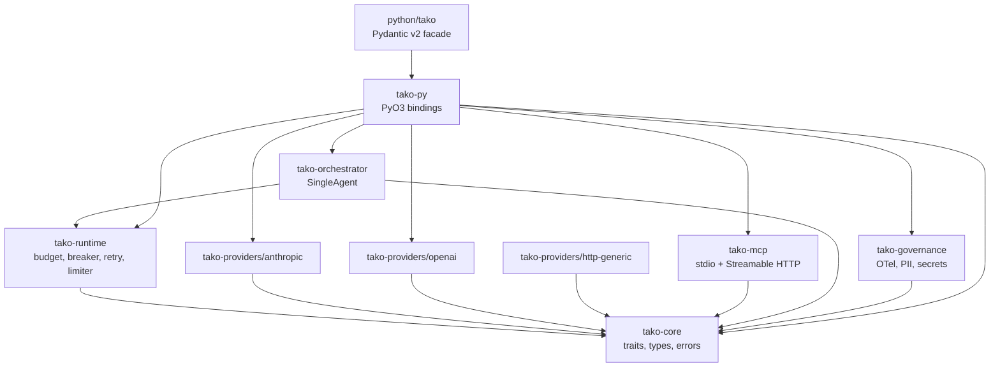
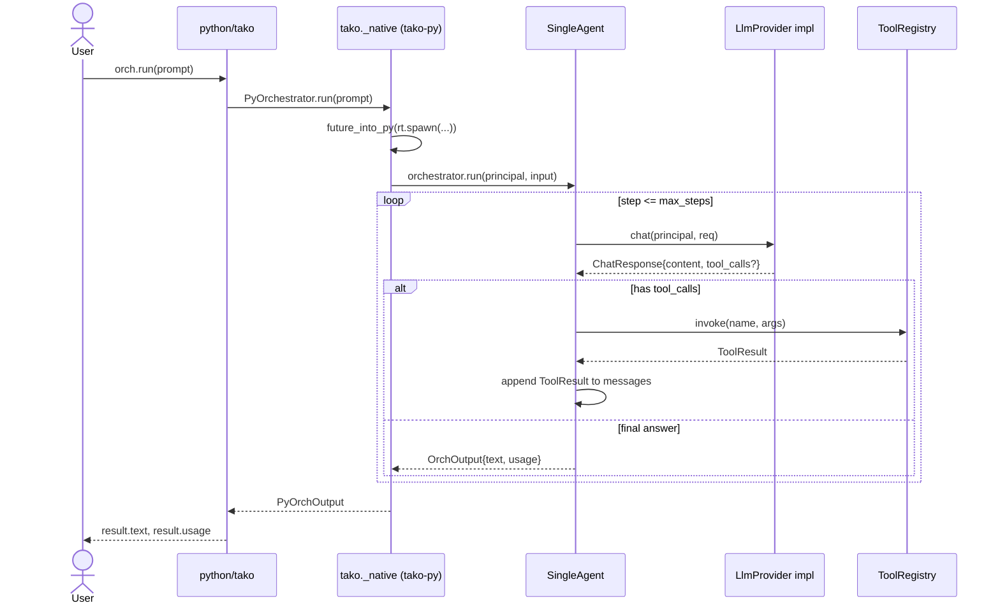

# tako — architecture

`tako` is a Rust workspace + Python facade. The Rust core does the work; the
Python facade is a thin, ergonomic shell over a PyO3 extension module.

## Crate graph



**Hard rules:**

- `tako-core` has no I/O, no Tokio. It defines the contracts.
- Provider crates depend only on `tako-core` + their vendor SDK + `reqwest`/`eventsource-stream`. They never depend on each other or on `tako-runtime`.
- `tako-py` is the only crate that knows about Python.
- `python/tako/` imports `tako._native` and **only** `tako._native`. End users import `tako.*`.

## Sequence: a `SingleAgent.run(prompt)` call



OTel spans:

- root: `tako.orchestrator.run` with `tako.orchestrator.kind=single`,
  `tako.principal.tenant_id`, `tako.principal.user_id`
- per provider call: child `tako.provider.chat` with `tako.provider.id`,
  `tako.provider.model`, `tako.tokens.input`, `tako.tokens.output`,
  `tako.cost.usd`, plus the `gen_ai.*` semconv attributes
- per tool call: child `tako.tool.invoke` with `tako.tool.name`,
  `tako.tool.duration_ms`

## Async + GIL discipline

`tako-py` builds a single shared Tokio runtime at module init via
`pyo3_async_runtimes::tokio::get_runtime()`. Every `#[pyfunction]` async
wrapper returns a Python awaitable produced by
`pyo3_async_runtimes::tokio::future_into_py`. Inside the future we **never**
hold the GIL across an `.await`. Sync siblings (`run_sync`) are wrapped in
`py.detach(|| runtime.block_on(...))`, releasing the GIL before blocking. The
`test_async_concurrency.py` suite runs 10 parallel orchestrator invocations
against a delaying `FakeProvider` and asserts wall-clock < 1.5× single-run
time — if the GIL leaks, this test fails.

## Data flow

```
ChatRequest (tako-core)
    ↓ to_vendor()
vendor JSON (per-provider)
    ↓ HTTPS / SSE
vendor response
    ↓ from_vendor()
ChatResponse / Stream<ChatChunk>
```

All vendor errors are mapped to `TakoError::Provider` with the original
status + body preserved in the structured `details` field. Streaming
contract: yield all received chunks, then `ChatChunk::Error`, then exactly
one `ChatChunk::End` — even on mid-stream failure.

## Reliability layers

```
SingleAgent.run
    ↓
FallbackProvider (cascade)
    ↓
RateLimiter (governor)
    ↓
CircuitBreaker (failsafe)
    ↓
Retry with jitter (backoff)
    ↓
LlmProvider impl (vendor SDK / HTTP)
```

`BudgetTracker` is consulted both before the call (using
`LlmProvider::estimate_cost_usd`) and after (reconciling against actual usage
returned in the response).

## Phase boundaries

This file describes **Phase 1**. Phase 2 adds Conductor, OPA enforcement, the
OpenAI-compat server, and cloud-vendor providers. Phase 3 adds Trinity
routing and SelfCaller recursion. Phase 4 adds AB-MCTS, Sigstore, and the
Redis budget backend. The trait surface in `tako-core` is designed so each
phase is purely additive.
