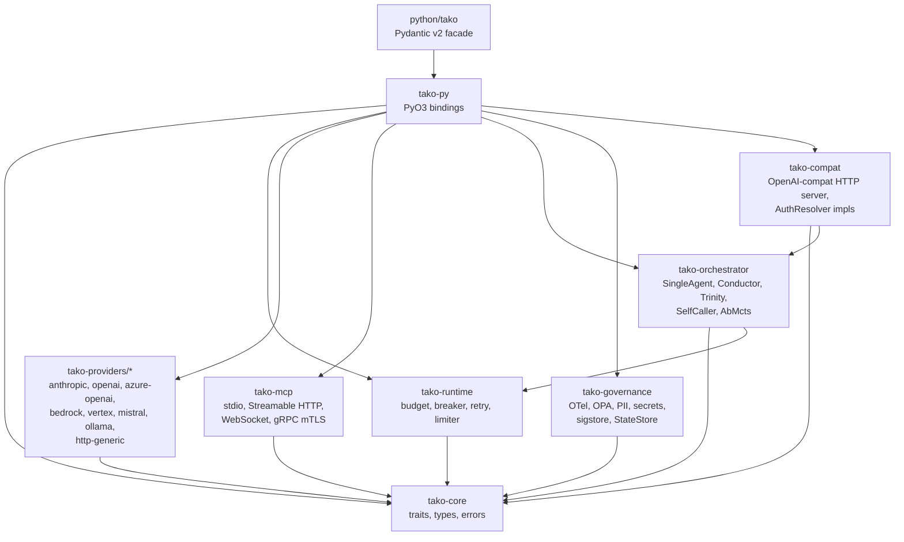
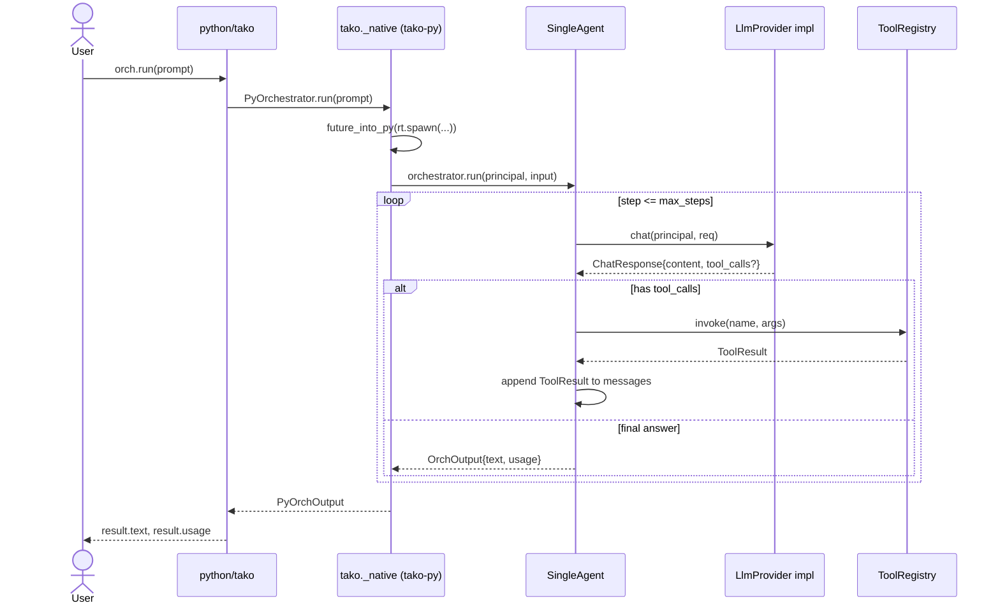
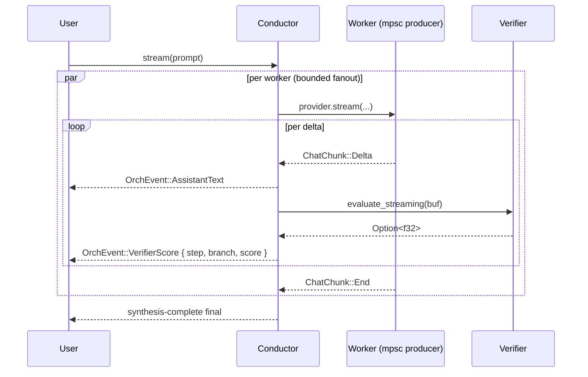

# tako — architecture

`tako` is a Rust workspace + Python facade. The Rust core does the work; the
Python facade is a thin, ergonomic shell over a PyO3 extension module.

## Crate graph



**Hard rules:**

- `tako-core` has no I/O, no Tokio. It defines the contracts — five public
  traits (`LlmProvider`, `Tool`, `McpTransport`, `Router`, `PolicyEngine`,
  `Verifier`) plus the request/response/error types every provider speaks.
- Provider crates depend only on `tako-core` + their vendor SDK + `reqwest` /
  `eventsource-stream`. They never depend on each other or on
  `tako-runtime`. Per-provider helpers (URL pre-fetch SSRF guard, MIME
  filters, data-URL prefix normalisation) are duplicated per crate rather
  than centralised — the dep-graph rule wins over DRY.
- `tako-py` is the only crate that knows about Python.
- `python/tako/` imports `tako._native` and **only** `tako._native`. End
  users `import tako.*`.

## Sequence: a `SingleAgent.run(prompt)` call



OTel spans:

- root: `tako.orchestrator.run` with `tako.orchestrator.kind=single`,
  `tako.principal.tenant_id`, `tako.principal.user_id`
- per provider call: child `tako.provider.chat` with `tako.provider.id`,
  `tako.provider.model`, `tako.tokens.input`, `tako.tokens.output`,
  `tako.cost.usd`, plus the `gen_ai.*` semconv attributes
- per tool call: child `tako.tool.invoke` with `tako.tool.name`,
  `tako.tool.duration_ms`
- per policy decision: child `tako.policy.evaluate` with
  `tako.policy.stage`, `tako.policy.decision`

## Streaming sequence (`Conductor::stream`)

`Conductor`, `Trinity`, and `AbMcts` all stream natively via `OrchEvent`.
The wiring uses bounded `mpsc::channel(64)` channels for per-delta
backpressure: producers block on `send().await` once the consumer is
behind, capping in-flight memory under slow `evaluate_streaming`
verifiers or slow downstream sinks. Trinity is naturally serial (no
channel needed).



## Async + GIL discipline

`tako-py` builds a single shared Tokio runtime at module init via
`pyo3_async_runtimes::tokio::get_runtime()`. Every `#[pyfunction]` async
wrapper returns a Python awaitable produced by
`pyo3_async_runtimes::tokio::future_into_py`. Inside the future we **never**
hold the GIL across an `.await`. Sync siblings (`run_sync`) are wrapped in
`py.detach(|| runtime.block_on(...))`, releasing the GIL before blocking. The
`test_async_concurrency.py` suite runs 10 parallel orchestrator invocations
against a delaying `FakeProvider` and asserts wall-clock < 1.5× single-run
time — if the GIL leaks, this test fails.

## Data flow

```
ChatRequest (tako-core)
    ↓ to_vendor()
vendor JSON (per-provider)
    ↓ HTTPS / SSE
vendor response
    ↓ from_vendor()
ChatResponse / Stream<ChatChunk>
```

All vendor errors are mapped to `TakoError::Provider` with the original
status + body preserved in the structured `details` field. Streaming
contract: yield all received chunks, then `ChatChunk::Error`, then exactly
one `ChatChunk::End` — even on mid-stream failure.

Vision content (`ContentPart::Image`, `ContentPart::ImageUrl`) flows
through every SDK-backed provider; Bedrock and Ollama use opt-in
tako-side URL pre-fetch with full SSRF mitigation (default-on private-IP
blocklist + DNS-rebind defence + per-host / wildcard / CIDR allowlist).

## Reliability layers

```
Orchestrator (SingleAgent | Conductor | Trinity | SelfCaller | AbMcts)
    ↓
FallbackProvider (cascade)
    ↓
RateLimiter (governor)
    ↓
CircuitBreaker (failsafe)
    ↓
Retry with jitter (backoff)
    ↓
LlmProvider impl (vendor SDK / HTTP)
```

`BudgetTracker` is consulted both before the call (using
`LlmProvider::estimate_cost_usd`) and after (reconciling against actual
usage returned in the response). Budget backends ship in two flavours:
in-memory (single-process) and Redis (multi-replica, with monotonic-write
Lua so a slow replica cannot clobber a higher water-mark).

## Phase boundaries

The trait surface in `tako-core` is designed so each phase is purely
additive — public APIs from earlier phases never break. As of v0.35.0
(Phase 34), the project ships every capability described on this page.
For the chronological ledger of which capability landed in which phase,
see the [feature matrix in README.md](https://github.com/nyankobu010/tako-ai-core/blob/main/README.md#feature-matrix)
and [`PLAN.md`](https://github.com/nyankobu010/tako-ai-core/blob/main/PLAN.md).
